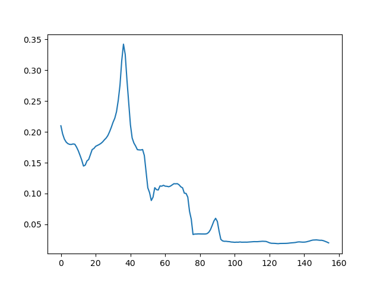

WARNING: this is all first-draft code.  I need someone else to review it and make sure I’m thinking the right way.

Also, please don’t judge me on the quality of this code.  I wrote it on the couch with kids screaming at me, it doesn’t reflect the quality of my normal professional code. It’s a hack to get a result.

Please double check that all of my indices match up nicely.  With windows and lags and all of that, I can have easily messed up some bookeeping. 

I welcome all PRs or comments.  

I start with the cases (blue) and deaths (orange) by week.  X-axis is the week number since the start of the epoch (5/24/2020)  This data comes from Steve (https://github.com/skirsch/R-projects/tree/main/nursing)


The goal is to predict the deaths as a function of cases.  Let’s look at a window of four weeks.  The number of deaths at the end of week 4 is a fraction the number of cases during week 4 (people who died in this week), plus some fraction of the number of cases in week 3 (people who took 2 weeks to die), plus some fraction of the number of cases in week 2 (people who took 3 weeks to die), plus some fraction of the number of cases in week 1 (people who took 4 weeks to die).

More formally, our function is
$$
D_w=\sum_{l=0}^La_l \times C_{w-l}
$$
where $D_w$ is deaths in week, $w$, $a_l$ is the fraction of cases from $l$ weeks ago that died, and $C_w$ is the number of cases in week, $w$.

We constrain our selection of $a_l$ be based on a survival function, $S$
$$
D_w=a\sum_{l=0}^LS_l \times C_{w-l}
$$
where $a$ is simply a scaling coefficient, and we find a survival function, $S_l$ that describes the fraction of people that are left after week $l$.

We look at two survival functions, and use the scipy defintions:

lognormal, as `scipy.stats.lognorm` (https://docs.scipy.org/doc/scipy/reference/generated/scipy.stats.lognorm.html)

Weibull, as `scipy.stats.weibull_min` (https://docs.scipy.org/doc/scipy/reference/generated/scipy.stats.lognorm.html)

For the lognormal, we do a non-linear least squares fit to find the shape and scale parameter that best fits the data.  For the Weibull, we fix the shape parameter at 2 since that’s the commonly accepted formula for a survival function.

We define the survival function at lag $l$ to be the integral of the probability distribution function (PDF) between $l$ and $l+1$, which is can be interpreted at the number of people that died between the start and end of week, $l$.  In the code this is the difference of the cumulative distribution function (CDF) at $l+1$ and $l$.

Given a PDF, $f(l)$, that returns the probability density of dying at week, $l$, we compute the survival function as 
$$
S_l=\int_l^{l+1}f(l)dl
$$
In the python code, we are minimizing the residuals of 

``` python
def lag_lognormal(x, s, scale, a):
    # apply the lag function above with the lognormal distribution
    return a*do_lag(x, scipy.stats.lognorm(s, loc=0, scale=scale))

def lag_weibull2(x, scale, a):
    # apply the lag function with a weibull set to '2' which is the typical survival function
    return a*do_lag(x, scipy.stats.weibull_min(2, loc=0, scale=scale))

```

where `do_lag` is

```python
def do_lag(x, f):
    # given a probability distribution, f
    # and a time series, x
    # compute the sum of the lags up to lagmax
    # this is used in the fitting functions
    y = x*(f.cdf(1)-f.cdf(0))
    for lag in range(1, lagmax):
        y[lag:] += x[0:-lag]*(f.cdf(lag+1)-f.cdf(lag))
    return y
```

Taking a subset of the data between weeks 10 and 40 which is before both the vaccine rollout and the Omicron surge where we expect the CFR to be relatively constant, we can fit the survival function to the case and death data.

After fitting the coefficients, the lognormal PDF looks like this


which has this survival function


And the Weibull PDF looks like this


which has this survival function


Both methods fit the empirical data well.  Blue is the real data, orange is the fit.  The large mismatch after week 75 is the Omicron surge which changes the death rates.

lognormal


Weibull


Since the Omicron surge changes the coefficients, it’s likely that the vaccine rollout should change the coefficients too.  If we had a safe and effective vaccine then we’d expect two things: 1) the overall CFR would go down, that is our $a$ parameter should get smaller after the vaccine and 2) it should take longer to die, that is $S_0$ should go down relative to $S_1$, $S_2$, $S_3$

So, let’s take a sliding window of 12 weeks and redo the fit to that data, I include here only the Weibull distribution because it seems to be the most robust to the short data window.  That is we can compute $a$ and $S_l$ at week 12 based on weeks 1 through 12 case and death data, then again at week 13 based on weeks 2-13, and so on.

Here’s $a$ as a function of week for the Weibull fit



And here’s the $S_0$ coefficient, that is, the fraction of people who died in the first week.


And the product of $a$ and $S_0$ can be interpreted as the "week 1 CFR".  The fraction of people who die within one week of catching COVID.


Keep in mind that the vaccine rollout is around week 32 and the first booster was around week 68 in this data.  (If this is a reasonable analysis, I’ll make much prettier plots!). We see that before the rollouts, $a$ was trending down and _sharply_ turned around after the rollout.  That means that the vaccine was changing the overall CFR to be _higher_, and that $S_0$ also turned around towards 1.0, which means that the fraction of people dying were dying earlier.

The $a$ coefficient (fraction of people dying) is very obvious at the original vaccine rollout, it skyrockets.  It’s less dramatic at the booster (probably because of the deadwood phenomenon).  But at the booster $S_0$ does go back up quickly, meaning that it’s pulling forward deaths.

Omicron is around week 80 and that changes everything, basically people stop dying ($a$ goes way down), and those that do die are quite weak and died early ($S_0$ is large), probably because they’re immune system is messed up from the booster.
